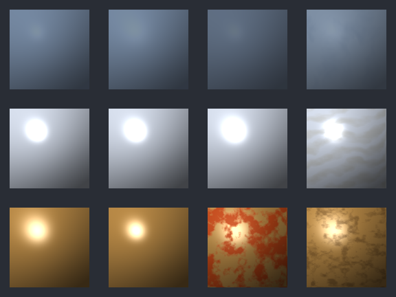

# M11-S5 Material Family Preview Grid

Generated material preview set for the M11 Metal visual proof promotion.

- proof id: `m11_s5_material_family_preview_grid`
- rendered preview: `preview.bmp`
- web preview: `preview.png`
- effective summary: `summary.json`
- source command: `make -C ray_tracing test-ray-tracing-material-family-preview-grid`

## Variant Order

Contact-sheet cells are ordered left-to-right inside each row.

| Row | Family | Preset | Variants | Row Artifacts |
| --- | --- | --- | --- | --- |
| 1 | Glass | `MATERIAL_PRESET_TRANSPARENT` / `5` | `clear_a062`, `frosted_a062`, `dense_a082`, `fog_overlay` | [BMP](glass_preview.bmp) / [PNG](glass_preview.png) |
| 2 | Mirror | `MATERIAL_PRESET_MIRROR` / `1` | `polished_ref096`, `soft_ref088`, `rough_ref072`, `oil_overlay` | [BMP](mirror_preview.bmp) / [PNG](mirror_preview.png) |
| 3 | Rough Metal | `MATERIAL_PRESET_ROUGH_METAL` / `2` | `rough_ref070`, `polished_ref082`, `rust_overlay`, `grime_overlay` | [BMP](metal_preview.bmp) / [PNG](metal_preview.png) |

## Request Readback

- Glass request: `glass_request.json`; summary: `glass_summary.json`
- Mirror request: `mirror_request.json`; summary: `mirror_summary.json`
- Metal request: `metal_request.json`; summary: `metal_summary.json`

This set promotes the generated M11-S4 build artifact into a durable preview
reference for compact material-family proof/readback. It does not promote
first-class metallic into the runtime payload or BSDF contract.
