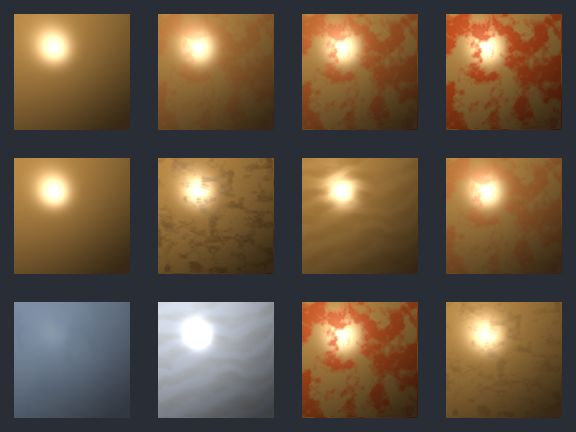

# M12-S5 Layer Control Preview Grid

Generated material preview set for the M12 layer-control visual proof promotion.

- proof id: `m12_s5_layer_control_preview_grid`
- rendered preview: `preview.bmp`
- web preview: `preview.png`
- effective summary: `summary.json`
- source command: `make -C ray_tracing test-ray-tracing-material-layer-control-preview-grid`

## Variant Order

Contact-sheet cells are ordered left-to-right inside each row.

| Row | Focus | Variants | Row Artifacts |
| --- | --- | --- | --- |
| 1 | Rough Metal - Rust Opacity | `base_no_overlay`, `rust_op025`, `rust_op060`, `rust_op095` | [BMP](metal_opacity_preview.bmp) / [PNG](metal_opacity_preview.png) |
| 2 | Rough Metal - Signed Influence | `neutral_ref078`, `attenuate_refl`, `boost_spec`, `strength_035` | [BMP](metal_influence_preview.bmp) / [PNG](metal_influence_preview.png) |
| 3 | Family Layer Examples | `glass_fog_trans`, `mirror_oil_spec`, `metal_rust_rough`, `metal_grime_mute` | [BMP](family_layer_examples_preview.bmp) / [PNG](family_layer_examples_preview.png) |

## Request Readback

- Rough Metal - Rust Opacity: `metal_opacity_request.json`; summary: `metal_opacity_summary.json`
- Rough Metal - Signed Influence: `metal_influence_request.json`; summary: `metal_influence_summary.json`
- Family Layer Examples: `family_layer_examples_request.json`; summary: `family_layer_examples_summary.json`

This set promotes M12 layer-control proof. It demonstrates layer opacity,
placement strength, and signed response influence changes through the
headless Material preview path. It does not promote first-class metallic
or change runtime payload semantics.
