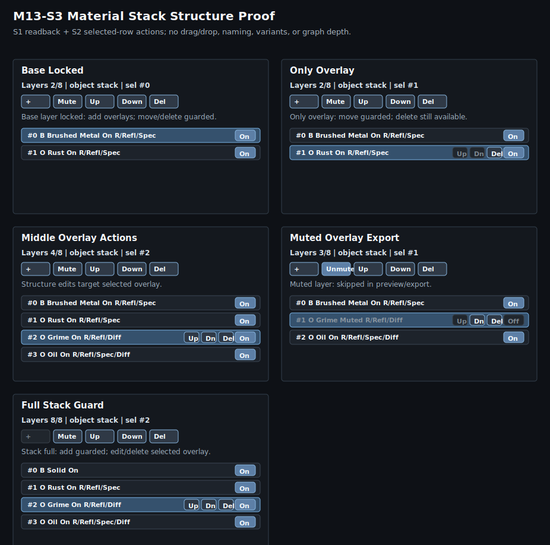

# M13-S3 Stack Structure Proof Grid

Generated editor/readback proof set for M13 stack-structure editability.

- proof id: `m13_s3_stack_structure_proof_grid`
- rendered proof: `preview.svg`
- effective summary: `summary.json`
- source command: `make -C ray_tracing test-ray-tracing-material-stack-structure-proof-grid`

## Covered States

| Case | Readback / affordance |
| --- | --- |
| Base Locked | `Base layer locked: add overlays; move/delete guarded.` |
| Only Overlay | `Only overlay: move guarded; delete still available.` |
| Middle Overlay Actions | `Structure edits target selected overlay.` |
| Muted Overlay Export | `Muted layer: skipped in preview/export.` |
| Full Stack Guard | `Stack full: add guarded; edit/delete selected overlay.` |

This proof covers the compact Material editor Stack pane structure surface:
source/count/selection readback, guard text, muted preview/export state,
and selected-overlay row-local `Up`, `Dn`, and `Del` actions. It does not
prove renderer material differences; M12-S5 remains the layer-control visual
rendering proof.
