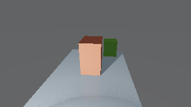
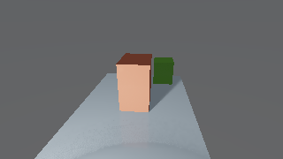
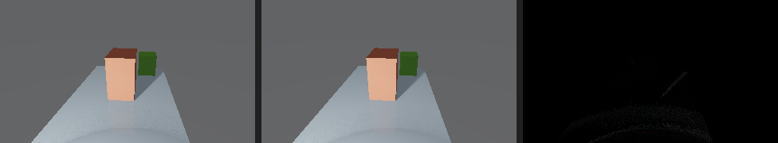

# Disney V2 D2.18 Denoise On/Off Visual Proof

Status: generated locally 2026-06-15.

This proof compares the experimental `disney_v2` route with the same scene,
camera, resolution, and `temporal_frames=12`, changing only the headless request
override `render.denoise_enabled`. It is the first apples-to-apples denoise
ablation for D2.18 and does not alter or promote the shipped `disney`
integrator.

The fixture is the primitive glass corridor scene used by the Disney v2 proof
lane. It includes stable triangle interiors, transparent glass geometry, and an
emissive object, which makes it a useful small scene for checking that denoise
smooths stable areas without erasing clean silhouettes or transparent surfaces.

## Review Images

- denoise off, 12 temporal frames: `denoise_off_12.png`
- denoise on, 12 temporal frames: `denoise_on_12.png`
- absolute RGB difference, amplified 4x: `diff_abs_amplified4x.png`
- absolute RGB difference, amplified 8x: `diff_abs_amplified8x.png`
- side-by-side off / on / 4x diff:
  `side_by_side_denoise_off_12_denoise_on_12_diff4x.png`







## Requests

- off request: `request_denoise_off_12.json`
- on request: `request_denoise_on_12.json`
- off summary: `summary_denoise_off_12.json`
- on summary: `summary_denoise_on_12.json`
- diff metrics: `diff_metrics.json`

## Result

- route: `disney_v2`
- comparison: both renders are `320x180`, `temporal_frames=12`
- changed request field: `render.denoise_enabled=false` vs
  `render.denoise_enabled=true`
- shared render stats: `visible_pixels=14811`, `nonzero_pixels=57600`,
  `secondary_rays=16848`, `secondary_hits=3839`,
  `temporal_committed_subpasses=12`, `max_radiance=5.030609983`,
  `max_rgb=[227, 191, 198]`
- off denoise stats: `applied=false`, all denoise counters are zero
- on denoise stats: `applied=true`, `raw_pixels=57600`,
  `reconstructed_pixels=11274`, `stable_interior_samples=235869`,
  `rejected_edge_samples=32382`, `preserved_transparent_pixels=662`,
  `preserved_mirror_glossy_pixels=0`,
  `skipped_unstable_temporal_pixels=2875`,
  `skipped_invalid_surface_pixels=42789`,
  `radiance_luma_delta=-0.884411491`
- diff metrics: `changed_pixels=6106`,
  `changed_pixel_ratio=0.106006944`, `changed_pixels_gt_2=1338`,
  `changed_pixels_gt_8=23`, `mean_abs_all_channels=0.161359954`,
  `rms_rgb_error=0.698688421`, `max_abs_channel_delta=12`
- BVH trace overflows: `0` for both renders

## Verification

```bash
make -C /Users/calebsv/Desktop/CodeWork/ray_tracing build/toolchains/clang/arm64/tools/cli/ray_tracing_render_headless
/Users/calebsv/Desktop/CodeWork/ray_tracing/tests/integration/run_ray_tracing_render_headless_disney_v2_denoise_matrix.sh
/Users/calebsv/Desktop/CodeWork/ray_tracing/tests/integration/generate_ray_tracing_denoise_review_artifacts.py --before-bmp /Users/calebsv/Desktop/CodeWork/ray_tracing/build/agent_runs/ray_tracing/disney_v2_visual_matrix/primitive_glass_corridor/disney_v2_denoise_off_12/frames/frame_0000.bmp --after-bmp /Users/calebsv/Desktop/CodeWork/ray_tracing/build/agent_runs/ray_tracing/disney_v2_visual_matrix/primitive_glass_corridor/disney_v2_denoise_on_12/frames/frame_0000.bmp --before-label denoise_off_12 --after-label denoise_on_12 --out-dir /Users/calebsv/Desktop/CodeWork/ray_tracing/docs/render_review_sets/disney_v2_d218_denoise_on_off_visual_proof
```

This is a first canonical visual-matrix cell, not the complete promotion visual
proof gate. Next visual-matrix growth should add dedicated transparent-interior,
mirror/glossy, high-noise emitter, and path-depth comparison cells.
