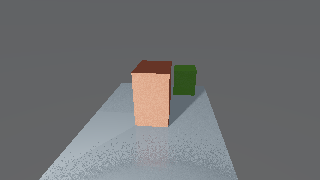
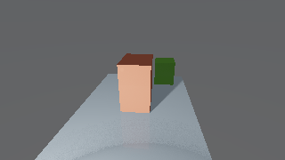
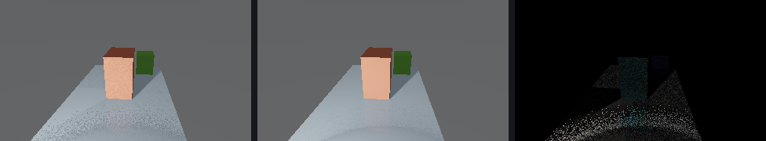

# Disney V2 D2.18 Denoise Visual Proof

Status: generated locally 2026-06-15.

This proof compares the experimental `disney_v2` route with one raw single
frame against a 12-subpass temporal resolve using the Disney-v2-specific
edge-safe denoise policy. It does not alter or promote the shipped `disney`
integrator.

The fixture is the primitive glass corridor scene used by the D2.5 Disney v2
proof lane. That scene includes transparent glass geometry and an emissive
transparent prism, which makes it a useful first visual check for preserving
hard object silhouettes while smoothing stable noisy triangle interiors.

## Review Images

- raw single frame: `raw_single.png`
- denoised 12-subpass frame: `denoised_temporal12.png`
- absolute RGB difference, amplified 4x: `diff_abs_amplified4x.png`
- absolute RGB difference, amplified 8x: `diff_abs_amplified8x.png`
- side-by-side raw / denoised / 4x diff:
  `side_by_side_raw_denoised_diff4x.png`







## Requests

- raw request: `request_raw_single.json`
- denoised request: `request_denoised_temporal12.json`
- raw summary: `summary_raw_single.json`
- denoised summary: `summary_denoised_temporal12.json`
- diff metrics: `diff_metrics.json`

## Result

- route: `disney_v2`
- raw render: `320x180`, `temporal_frames=1`
- denoised render: `320x180`, `temporal_frames=12`
- raw stats: `visible_pixels=14811`, `nonzero_pixels=57600`,
  `secondary_rays=17080`, `secondary_hits=3892`,
  `temporal_committed_subpasses=1`, `max_radiance=4.936036745`,
  `max_rgb=[230, 190, 197]`
- denoised stats: `visible_pixels=14811`, `nonzero_pixels=57600`,
  `secondary_rays=16848`, `secondary_hits=3839`,
  `temporal_committed_subpasses=12`, `max_radiance=5.030609983`,
  `max_rgb=[227, 191, 198]`
- diff metrics: `changed_pixels=12732`, `changed_pixel_ratio=0.221041667`,
  `mean_abs_all_channels=1.329826389`, `rms_rgb_error=4.281025102`,
  `max_abs_channel_delta=47`
- BVH trace overflows: `0` for both renders

## Verification

```bash
make -C /Users/calebsv/Desktop/CodeWork/ray_tracing build/toolchains/clang/arm64/tools/cli/ray_tracing_render_headless
/Users/calebsv/Desktop/CodeWork/ray_tracing/build/toolchains/clang/arm64/tools/cli/ray_tracing_render_headless --request /Users/calebsv/Desktop/CodeWork/ray_tracing/build/agent_runs/ray_tracing/disney_v2_d218_denoise_visual_proof/requests/primitive_glass_corridor_raw_single.json --render --summary /Users/calebsv/Desktop/CodeWork/ray_tracing/build/agent_runs/ray_tracing/disney_v2_d218_denoise_visual_proof/raw_single/render_summary.json
/Users/calebsv/Desktop/CodeWork/ray_tracing/build/toolchains/clang/arm64/tools/cli/ray_tracing_render_headless --request /Users/calebsv/Desktop/CodeWork/ray_tracing/build/agent_runs/ray_tracing/disney_v2_d218_denoise_visual_proof/requests/primitive_glass_corridor_denoised_temporal12.json --render --summary /Users/calebsv/Desktop/CodeWork/ray_tracing/build/agent_runs/ray_tracing/disney_v2_d218_denoise_visual_proof/denoised_temporal12/render_summary.json
```

This is an initial visual example, not the complete promotion visual-proof
gate. Promotion still needs canonical transparent/interior, mirror/glossy,
stable-interior, clean-edge, and high-noise scene coverage.
