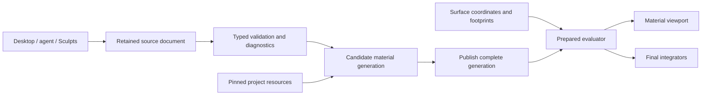

# Post-M6 material design and implementation plan

Status: T0 complete, including verified Main Edit source adoption. T1 authoring complete in isolated source; Main Edit adoption awaits explicit authorization. Verification is recorded in its contract. T2–T5 remain planned.
Date: 2026-09-21. Baseline: optiC `5afa2b7`, Sculpts `b28e82c`.
The user requested independent design audits and a better next-step plan before
working through further improvements. This document is the resulting execution
map, not a claim that the proposed features already exist.

## Decision

M0–M6 implemented useful material foundations, but the next goal is a coherent,
reliable authoring workflow. Prioritize **hardening → common authoring → resources
and preparation → composition → rendering quality/performance**. A larger node
canvas alone would expose today's fragmented contracts more prominently.

The three independent audits cover [architecture](design_audits/surface_material_architecture_audit.md),
[authoring](design_audits/surface_material_authoring_audit.md), and
[runtime/proof](design_audits/surface_material_runtime_audit.md).
They agree on reuse and the main functional gaps. Their recommended order differs:
architecture emphasizes composition, UI emphasizes complete creation/editing flows,
and runtime emphasizes lifecycle/cost first. The sequence below resolves that by
making correctness mandatory, delivering usable existing capabilities early, and
requiring resource ownership and filtering rules before broader composition.

## What the audit changes

1. **Adoption needs a hardening checkpoint first.** The compiled shared library
   reproduces a noise-period discontinuity and negative-coordinate mismatch.
   Preparation also has a verified non-transactional failure path; visible mixed
   scene corruption has not been reproduced. These are separate evidence levels.
2. **UI capability and runtime capability need to agree.** Graph objects receive
   mapping controls that the graph validator rejects. Mapped/typed materials
   bypass the established common inspector shell. Image-channel assignment and
   material creation still require external authoring.
3. **Passing parity is not complete correctness proof.** Same-evaluator adapter
   comparisons establish transport agreement; they missed the common noise bug.
   Independent source/filter references and complete channel checks are needed.
4. **Resource preparation precedes broad composition.** Per-object image ownership,
   duplicate validation/load preparation and full-scene reapplication will become
   more expensive as graphs grow. Preserve the no-IO/no-allocation shading path.
5. **Performance work must be measured.** Earlier two-triangle Material preview cost
   already reached 38–58ms. Geometry reduction alone cannot explain or fix that cost.

M0–M6 feature implementation and previous passing receipts remain historical facts.
They do not imply the newly discovered issues are fixed or hands-on acceptance is done.

## Target user workflow and layout

Keep one material workspace with the existing Scene tree and viewport. Every source
family uses the same assignment header and stable inspector sections:

| Area | User sees and does |
|---|---|
| Assignment | Object/face scope, material name, New/Assign/Duplicate/Replace, local edits versus source provenance |
| Appearance | Supported response channels and their controlling source/output; no unsupported controls |
| Sources | Stable layer/node/channel list, selected item parameters, named typed connections and outputs |
| Coordinates | Effective mapping for the selected source: UV set, planar/axial chart, rest/world coordinates; inheritance and overrides |
| Preview and validation | Actual Solid/Material mode, preparation/support status, actionable errors linked to node/property/resource |
| Advanced details | IDs, source pins, diagnostics and later graph canvas; optional rather than required for basic editing |

Concrete first artist workflow: select an imported UV mesh, create a material,
assign color/roughness and normal-or-height resources, inspect mappings, edit a
procedural preset, undo/redo, save/reopen and recover a missing resource. Initially
these remain the existing supported material families. Mixed image/procedural
composition becomes available only when its new runtime contract exists.

Named ports replace numbered inputs. Connection pickers show valid targets and
explain disabled ones. Numeric fields preload/select current values, keep rejected
drafts and show units/ranges. Source reset and mapping reset are distinct actions.
The preview mode remains explicit through edits and undo, with a one-click route
to Material preview. A future canvas is another view of these same commands.

## Target architecture

Keep source/node/mapping/resource/region IDs and optional producer metadata stable.
Compile old representations through compatibility adapters rather than rewriting
all retained documents. A prepared program has explicit typed coordinate/resource
bindings and channel outputs. Coordinates carry their domain and derivatives;
UVs retain set/chart/tangent identity. Weighted projections remain independent
samples before blending.

Use one authoritative semantic descriptor set for node/port/property types,
ranges/units and implemented combinations. Shared code owns pure contracts;
the app adds geometry/resource/backend availability. CLI validation, diagnostics
and inspector availability derive from those facts. Optional UI labels and layout
remain presentation concerns. Unknown required semantics still fail closed.

Image resources are immutable and content-addressed by digest plus decoding/channel
policy. Programs, resources and object frames have separate invalidation. Stage a
candidate generation, validate every required resource and publish it only after
success. A failed restore must be visible and must not leave mixed scene generations.

## Execution slices

### T0 — Correctness, failure handling and adoption gate

**Complete — implementation and Main Edit source adoption verified.** Findings A2/A5, R1/R2/R6 and U4.
See the [T0 contract and verification](surface_material_t0_contract.md).

- T0.1 Reproduce noise period/negative-coordinate behavior in permanent tests;
  correct lattice wrapping on all axes and record compatibility policy. Prefer
  a documented pre-adoption correction if the affected candidate is unshipped;
  use an explicit algorithm version if existing authored appearances must remain
  unchanged. Do not silently replace archived expected outputs.
- T0.2 Stage material state before replacing the active generation. Test allocation,
  decode/read and history/rollback failures. Define last-good versus empty/error
  behavior across scene objects, mappings, resources and graph programs together.
- T0.3 Return structured errors containing object/node/port/property identity and
  a stable reason. Gate graph-incompatible mapping controls before interaction.
- T0.4 Add full RGB and nonconstant roughness checks, independent source/projection
  oracles, period shifts and boundary tests. Preserve adapter parity as a separate
  test category. Re-run prior compatibility fixtures after source changes.
- T0.5 Review the hardened candidate for Main Edit adoption, then use retained
  M3–M6 fixtures for existing load/import/edit/duplicate/undo/save/reopen/render
  workflows. From-blank material creation and image-assignment acceptance follow
  T1/T2. Scripted native controls and hands-on acceptance are recorded separately.

**Exit:** period shifts agree within declared numerical tolerance; boundary error
converges as epsilon shrinks; each injected failure leaves one coherent generation;
errors identify the offending field; every exposed control is supported or explains
its restriction; legacy receipts remain unchanged except explicitly approved bugfix
expectations. Adoption must use a fresh source/dirty-state readback.

Main Edit adopted the M0–M6/T0 history from its freshly verified clean `c8f6477`
ancestor by fast-forward. T0 implementation is `a8ed1e1` plus the save-publication
correction `a0569ea`. Adopted application/native/headless builds and fresh M3–M6
retained workflows pass; final lifecycle and M3/M4 checks include the save correction.
Independent shared noise references, 29 diagnostic cases, injected generation and
save failures, and all eight unchanged legacy render hashes pass. Shared authored
texture minimum is 0.7.1. Installed builds and user hands-on acceptance remain
separate. **T1 follows this hardening checkpoint.**

### T1 — Complete authoring of existing capabilities

**Complete in source.** Depends on T0's diagnostics/capability gates. Findings U1/U2/U5–U9.
See the [T1 contract](surface_material_t1_contract.md) for implementation and verification.

- T1.1 Keep one assignment header and stable inspector sections across material families.
- T1.2 Add transactional New/Assign/Duplicate/Replace source commands. No manual JSON
  deletion; conversion shows its supported scope and preserves source metadata.
- T1.3 Add node list/search, creation/deletion, named connections and output wiring
  for the existing bounded graph. Report dependents before deletion; prevent cycles.
- T1.4 Normalize value editing, independent source/mapping resets, explicit preview
  state and usable short/narrow-panel behavior.

**Exit:** a scene with geometry and no authored material source reaches a valid
noise/triplanar material entirely through UI;
creation/replacement/connection edits each have predictable undo semantics; canceled
or rejected edits preserve source/draft; save/reopen preserves IDs and provenance;
normal-size and constrained-layout native captures are reviewed.

### T2 — Resource workflow and efficient preparation

Depends on T0 generations; uses T1's shell. Findings U3/U10, R4/R7.

- T2.1 Introduce shared immutable image ownership within the existing preparation
  pipeline. Cache keys include digest and interpretation, not merely file path.
- T2.2 Separate resource, program and frame invalidation. Validation should reuse
  prepared candidate resources instead of decoding/building them again at adoption.
- T2.3 Add M5 channel/resource cards: select files, encoding, normal-or-height,
  strength/scale, health, explicit relink and retained provenance.
- T2.4 Add project-relative resource resolution/bundling using existing scene
  dependency support. Compose projection → compile → validate → preview → adopt
  into one reviewable candidate workflow for generated UVs and producer scenes.

**Exit:** 100 objects sharing one image decode/build that content once per policy;
unrelated frame/camera edits decode zero images; cold/warm load, edit p50/p95,
bytes/build counts/evictions are recorded; file corruption/change/relocation and
budget failure recover explicitly; no per-hit IO/allocation is introduced.
Image UI initially exposes only currently implemented M5 combinations.

### T3 — One composable image/procedural material

Depends on T0 independent proof and T2 resource ownership; uses T1 editing.
Findings A1/A3/A4 and response-policy observations in R6.

- T3.1 Define an opt-in versioned prepared contract for named-UV images plus existing
  rest/world procedural sources. Preserve old document interpretation via adapters.
- T3.2 Deliver the first vertical slice: UV color image mixed with procedural dirt
  through an explicit mask, with scalar roughness output and retained source edits.
- T3.3 Integrate region selection/overrides under explicit precedence. Start with
  existing primitive face roles; arbitrary mesh-region identity needs its own gate.
- T3.4 Add normal/bump response through M5's basis math with documented blend order,
  normal/height compatibility and roughness moment/variance policy. Verify flat-normal
  invariance, zero-strength equivalence, mirrored tangent handedness and finite,
  nonnegative response under directional lighting against reference images.

**Exit:** one supported scene combines image albedo, procedural dirt and a region
assignment with source-preserving edit/undo/reopen. Mirrored/nonuniform transforms,
UV seams, constant-channel equivalence and linear/data encoding have independent
oracles. Directional-light reference renders must also demonstrate the integrator's
normal/bump and roughness response, beyond payload agreement. Unsupported combinations
remain rejected. Normal/bump and region coverage are separate sub-gates, not assumed
from color composition; these tests do not add T5's deferred advanced BRDF features.

### T4 — Secondary detail and measured interactive performance

Reference scenes begin during T0/T2; implementation can run as separate owned lanes
once relevant interfaces are stable. Findings R3/R5 and A4.

- T4.1 Establish supersampled direct/reflected texture references. Transport bounded
  footprints for delta reflection/refraction first; define rough/diffuse approximations
  separately. Measure contrast, temporal variation and composition-average error.
- T4.2 Instrument fixed-resolution preview costs before choosing an optimization:
  rasterization/shading versus geometry, 1/10/100 instances, 8K/100K/1M triangles,
  edit and orbit p50/p95 plus peak memory. Declare fixture hardware/resolution.
- T4.3 Optimize the measured dominant cost; share exact preview representations where
  possible. Add attribute-aware reduction only with chart/handedness preservation
  and an explicit image-error bound. Do not promise frame rate from triangle count.

**Exit:** reference error and interactive budgets are declared before optimization,
then met on named fixtures without hidden quality fallback. Performance changes
cannot trade away source semantics or independent correctness gates.

### T5 — Broader artist tools

Schedule after the workflows above are usable: general seam/atlas unwrap, richer
procedural families, optional spatial node canvas, multiple UV sets/UDIM and more
advanced directional response. Each requires its own source/runtime/UI capability
and acceptance slice. These are deferred opportunities, not required to call T0–T3
complete and not newly claimed M6 capabilities.

## Ownership and reuse decisions

| Concern | Decision | Owner |
|---|---|---|
| Typed source/coordinate/output semantics and pure filtering | reuse-extend | `core_authored_texture` |
| UV/tangent import and geometry attributes | reuse-adopted; extend only for a justified attribute change | `core_mesh_compile`, `core_mesh_asset` |
| Renderer-neutral attributed LOD | reuse-extend after profiling | `core_mesh_preview` |
| Generic transforms/units/math | reuse-adopted where existing contract fits | `core_space`, `core_units`, `core_math` |
| Dependency bundles and packed transport | reuse-adopted | `core_scene_compile`, `core_pack`; app resolves resource meaning |
| Controls, theme, fonts and later graph layout | reuse-adopted | existing `kit_ui`, `core_theme`, `core_font`; assess `kit_graph_struct` for a later canvas |
| Resource cache, generation lifetime, document commands, preview and integrators | app-owned | optiC |
| New generic runtime, job system, database or shader framework | reuse-deferred; not justified | none proposed |

Pure shared changes follow module version/tests/docs and explicit canonical/vendor
adoption. No shared version changes occur in this audit. No new runtime or storage
system is needed for the proposed material cache. Preserve existing unrelated
canonical shared changes rather than broadly syncing or committing that owner tree.

## Work discipline and immediate next step

This audit changed planning documents only and added a standalone reproduction
probe. It did not merge Main Edit, patch product behavior, launch the user's app,
change installed artifacts or run a release lane.

**Next execution slice is T0.** Its first reviewable change should pair the noise
regression/correction and compatibility note; the generation/failure work then
lands as its own bounded change with fault-injection proof. UI and wider composition
start against those verified contracts. A later instruction to start a named slice
authorizes implementation; this audit's planning status is not a perpetual approval gate.
